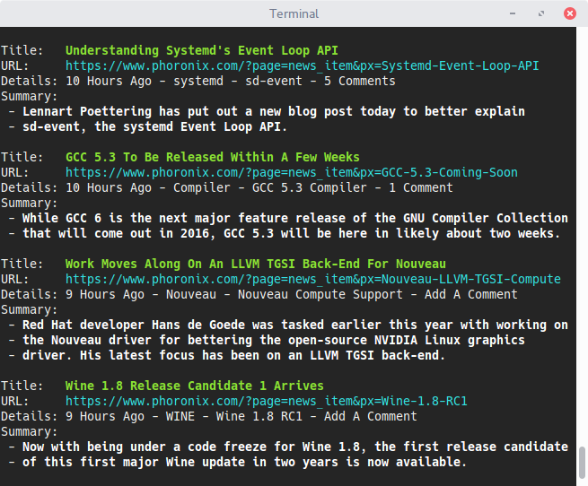

# Phoronix Reader

This app allows users keep up-to-date with the latest Phoronix news from the comfort of their terminals.

## Screenshot

## Installation Guide

To install, you will need to make sure that you have `Cargo` and `Rust` installed.

Simply run `cargo install` to build and install the project, or `cargo build --release`.

## Step-by-Step Making Of Tutorial

I have also created a step-by-step tutorial detailing how this program was created on **Gitbooks**.
https://www.gitbook.com/book/mmstick/guide-to-writing-the-phoronix-reader-in-rust/details
