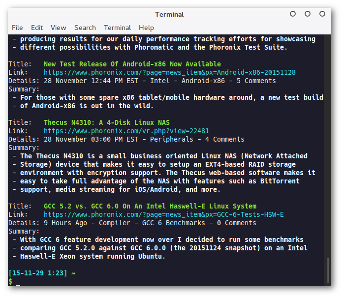
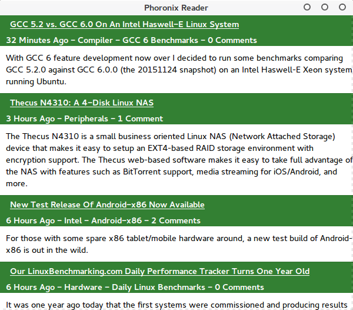

# Phoronix Reader

This app allows users to keep up-to-date with the latest Phoronix news from the comfort of their terminals.

## Screenshots

### Command-Line Interface



### GTK3 Graphical User Interface



## Installation Guide

To install, you will need to make sure that you have `Cargo` and `Rust` installed.

Simply run `cargo install` to build and install the project, or `cargo build --release`.

Both the colored terminal output and GTK3 interface are optional and can be enabled during build.

### Enable Colored Terminal Output

```
cargo build --release --features "enable_colors"
```

### Enable GTK3 Support

```
cargo build --release --features "enable_gtk"
```

### Enable Both

```
cargo build --release --features "enable_colors enable_gtk"
```

## Step-by-Step Making Of Tutorial

I have also created a step-by-step tutorial detailing how this program was created on **Gitbooks**. <https://www.gitbook.com/book/mmstick/rust-programming-phoronix-reader-how-to/>
